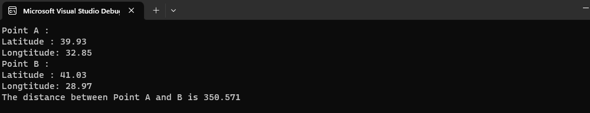

# Lab Exercise 2: Functions 

#### Q1. You are asked to write a program that calculates the distance in kilometers between two points on the world whose latitude and longitude values are known. Latitude and longitude values must be in radians. For this divide the values by 180/PI or 57.29577951.The distance formula for Point A(x1,y1) and Point B(x2,y2)

### d=r * acos(sin(x1)sin(x2) + cos(x1)cos(x2)cos(y2-y1))
### r is referred Radius of the World. It is taken by 6378.137 km.

###### Make sure written program has to include

- First item
- Second item
- Third item

Make the necessary functions and definitions inside the program to work and produce the
following sample output.

Point A: \
Latitude: 39.93 \
Longtitude: 32.85 \
Point B: \
Latitude: 41.03\
Longtitude:28.97\
The distance between Point A and B is  **350.571km**

### My Output :

